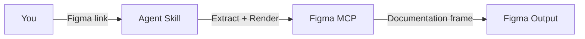
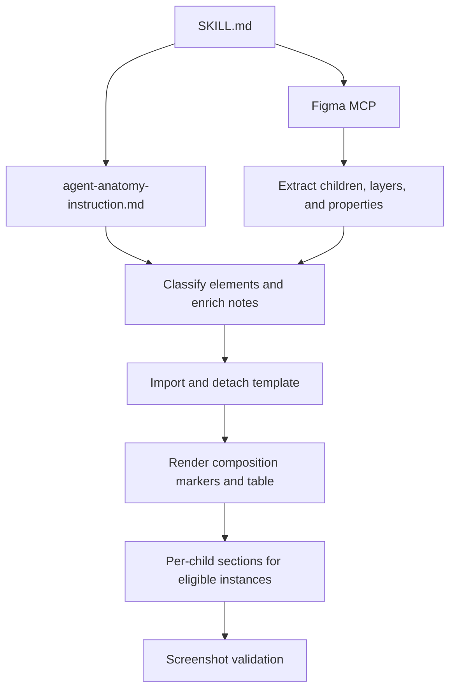
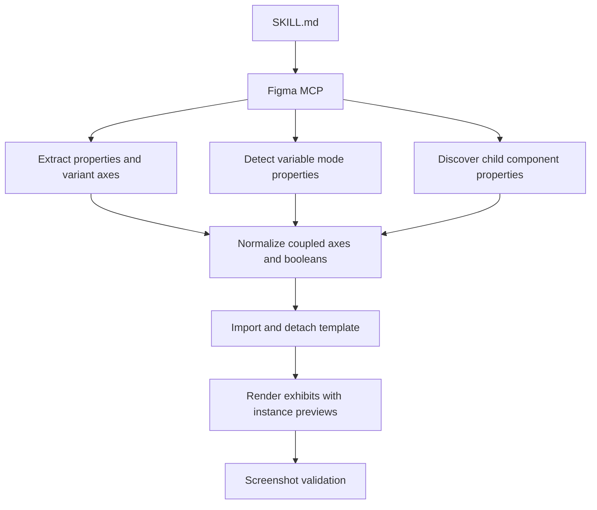
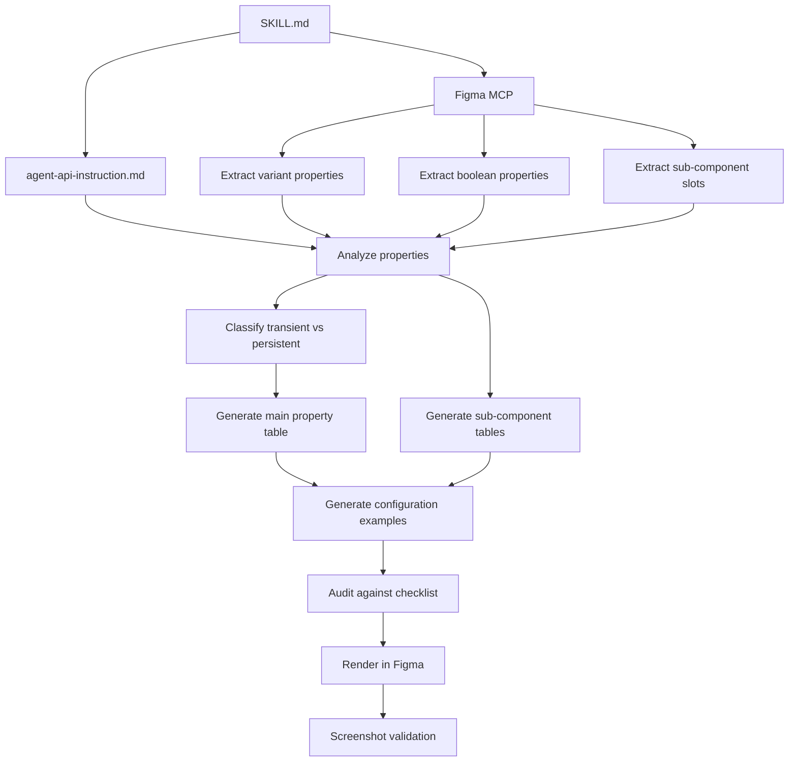
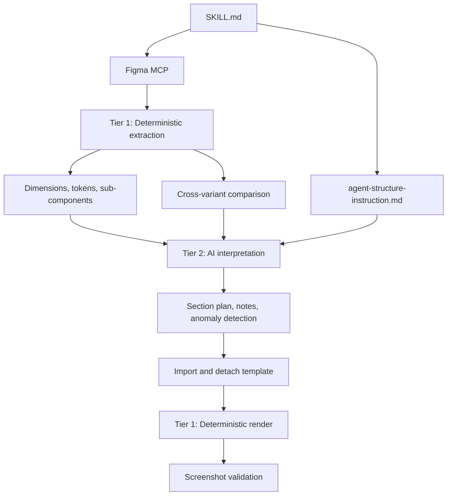
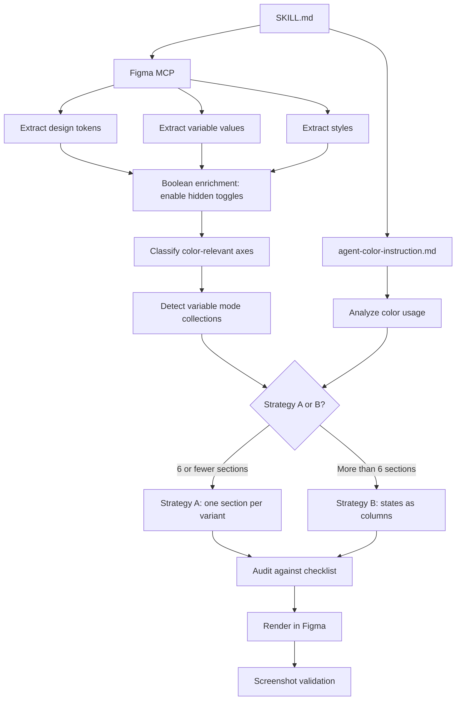
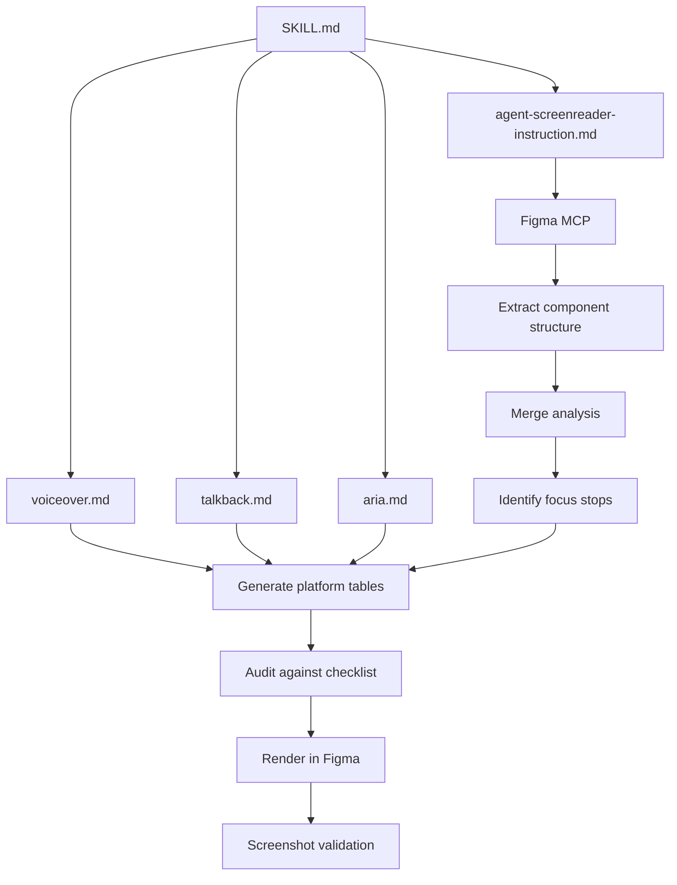
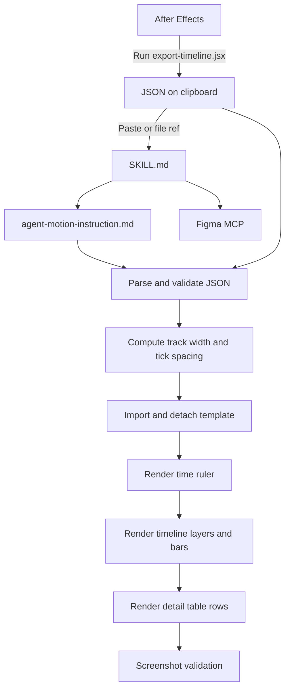
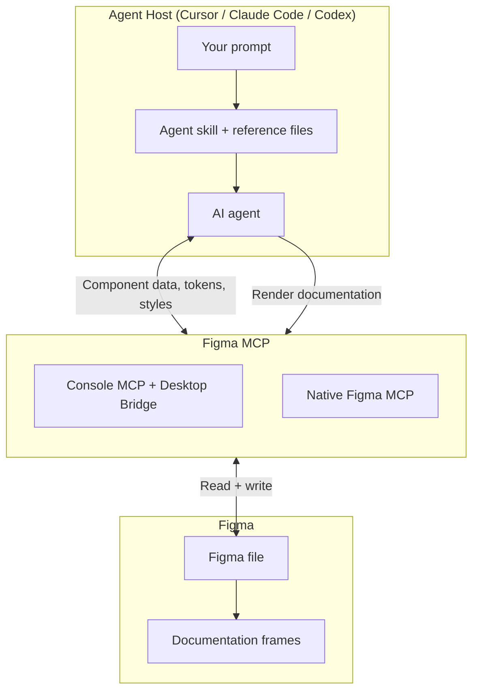

uSpec connects your AI agent and Figma into a single pipeline. You provide a component link and context, and the system produces formatted documentation directly in your Figma file.

## The pipeline at a glance

Every skill extracts component data and renders documentation directly in Figma via the MCP. The internal steps differ depending on what each skill needs to analyze. The diagrams below show what happens inside each skill.

---

## Triggering a skill

<Tabs>
  <Tab title="Cursor">
    Skills are triggered by typing `@` followed by the skill name in Cursor's chat.

    <Steps>
      <Step title="Type @">
        In Cursor's chat, type `@`. Cursor shows an autocomplete menu of available skills.
      </Step>
      <Step title="Select a skill">
        Continue typing to filter (e.g., `@create-v`) or use arrow keys to select. The skill name must match exactly: `@create-voice`, not `create voice` or `voice spec`.
      </Step>
      <Step title="Add your prompt">
        After the skill name, paste a Figma link and add any context about states, variants, or behaviors.
      </Step>
    </Steps>

    <Tip>
      If autocomplete doesn't show the skill, verify the uSpec project is open in Cursor. Skills load from the `.cursor/skills/` folder.
    </Tip>
  </Tab>

  <Tab title="Claude Code">
    Skills are triggered with `/skill-name` or by asking naturally — Claude auto-discovers skills from their description.

    <Steps>
      <Step title="Invoke a skill">
        Type `/create-voice` to invoke directly, or just describe what you need (e.g., "create a screen reader spec"). Claude matches skills from `.claude/skills/` by their description.
      </Step>
      <Step title="Add your Figma link">
        Paste the Figma component URL and describe the states, variants, or behaviors you want documented.
      </Step>
    </Steps>

    <Tip>
      Claude Code reads `CLAUDE.md` at the project root for context. Make sure you're running from the uSpec directory.
    </Tip>
  </Tab>

  <Tab title="Codex">
    Skills are triggered with `$skill-name` or matched implicitly from their description.

    <Steps>
      <Step title="Invoke a skill">
        Type `$` to mention a skill explicitly (e.g., `$create-voice`), or describe what you need and Codex matches skills from `.agents/skills/` by their `description` frontmatter. Use `/skills` to browse available skills.
      </Step>
      <Step title="Add your Figma link">
        Paste the Figma component URL and describe the states, variants, or behaviors you want documented.
      </Step>
    </Steps>

    <Tip>
      Codex reads `AGENTS.md` at the project root. Make sure you're in the uSpec directory.
    </Tip>
  </Tab>
</Tabs>

---

## Inside each skill

Every skill loads an instruction file, reads platform-specific or domain-specific reference files, extracts data from Figma via MCP, runs through a checklist, and renders the output. The reference files determine what the agent knows about each domain.

<Tabs>
  <Tab title="Anatomy">
    The anatomy skill extracts child layers, element types, and property definitions, then classifies each element's role before rendering numbered markers with an attribute table directly in Figma.

  The skill reads child layers, element types, visibility, and property definitions (booleans, variant axes, instance swaps) from the component. An AI classification step then determines each element's role (optional slot, fixed sub-component, content element, structural/decorative) and writes semantic notes. Utility sub-components like Spacer and Divider are automatically skipped. Eligible nested instances get their own per-child sections with separate markers and tables, and cross-references link back from the composition table.
  </Tab>

  <Tab title="Properties">
    The property skill extracts variant axes, boolean toggles, variable modes, and child component properties, then renders visual exhibits with live instance previews directly in Figma.

  The skill reads `componentPropertyDefinitions` to discover all variant axes, boolean toggles, and instance swap properties. Variable mode collections (shape, density) are detected automatically. Child component properties are rendered in-context on parent instances.
  </Tab>

  <Tab title="API">
    The API skill loads its instruction file, identifies all configurable properties (including sub-component slots), and renders property tables with configuration examples directly in Figma.

  Transient states like hover and pressed are excluded from the API. They are handled at runtime. Only persistent, configurable properties like `isDisabled` or `isSelected` become API entries.
  </Tab>

  <Tab title="Structure">
    The structure skill uses a two-tier architecture: deterministic scripts handle data extraction and rendering, while AI reasoning is focused on interpretation and planning.

  The AI's reasoning budget is spent on interpretation — building the section plan, writing design-intent notes, and detecting anomalies — rather than data gathering. Deterministic scripts (~60% of the pipeline) handle extraction, cross-variant comparison, table rendering, and native Figma measurements. Values are reported as token references when bound to a variable (e.g., `sizing-button-lg (56)`) or as plain numbers when hardcoded.
  </Tab>

  <Tab title="Color Annotation">
    The color skill loads a single instruction file, then extracts design tokens and variable values from Figma, classifies which axes and modes affect color, chooses a rendering strategy, and renders the annotation directly in Figma.

  The agent reads token names directly from Figma variables, so the output uses your actual token naming conventions rather than generic names. Hidden boolean toggles are enabled during extraction to capture color bindings that only appear when optional elements are visible. The strategy decision determines the output layout: Strategy A renders one section per variant for simpler components, while Strategy B uses states as table columns for components with many variant combinations.
  </Tab>

  <Tab title="Screen Reader">
    The screen reader skill loads four reference files, one for general instructions and one per platform, then runs a merge analysis to determine focus stops before rendering per-platform tables directly in Figma.

  The merge analysis is the critical step. It determines which visual parts become independent focus stops and which get merged into a parent announcement. The three platform files provide the exact property names and announcement patterns for iOS, Android, and Web.
  </Tab>

  <Tab title="Motion">
    The motion skill is unique: instead of extracting data from Figma, it reads pre-computed animation data exported from After Effects. The `export-timeline.jsx` script does the heavy lifting — pairing keyframes into segments, computing cubic-bezier easing curves, and filtering out static segments. The agent reads the segments directly and renders them as a timeline visualization in Figma.

  This is a two-step process: first run the export script in After Effects to get the JSON, then run the `create-motion` skill with that output. The JSON contains composition metadata (name, duration, fps, dimensions) and a flat array of layers, each with pre-computed segments containing timing, values, bar labels, and easing data. The agent computes only layout values (track width, pixels per millisecond) and passes everything else through to Figma.
  </Tab>
</Tabs>

---

## What the agent sees vs. what you provide

The agent can extract structure, tokens, and styles from Figma automatically. But some information only exists in your head:

| The agent can extract | You need to describe |
|----------------------|---------------------|
| Component layers and hierarchy | States not visible in the current frame |
| Design token names and values | Behavioral modes (fill vs. hug, truncation) |
| Variant axes and properties | Focus order preferences |
| Visual dimensions and spacing | Platform-specific interaction details |
| Styles and color values | Business logic or conditional rules |

<Tip>
  The more context you provide in your prompt, the more accurate the output. A one-line prompt works, but adding states, behaviors, and edge cases produces significantly better specs.
</Tip>

---

## Architecture overview

uSpec supports two Figma MCP providers — choose the one that fits your setup:

- **Figma Console MCP** (by Southleft) connects via a Desktop Bridge plugin running inside Figma Desktop, communicating over WebSocket. It exposes 59+ tools for design creation and variable management.
- **Native Figma MCP** (by Figma) connects directly to Figma's API with read and write access. No Desktop Bridge plugin required.

Both providers give the agent real-time access to component data, tokens, styles, and screenshots. Every skill renders through the MCP, regardless of which provider or host you use. See [Getting Started](/getting-started#2-set-up-figma-mcp) for setup instructions.

<Note>
  MCP providers update their capabilities and setup instructions frequently. For the latest details, see the [Figma Console MCP docs](https://docs.figma-console-mcp.southleft.com/) or the [native Figma MCP docs](https://github.com/figma/figma-mcp).
</Note>
