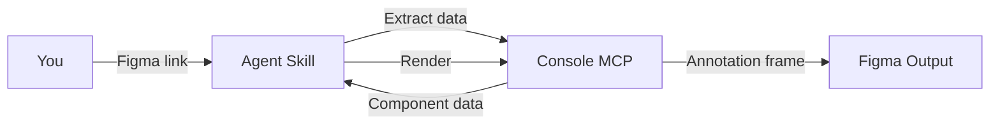

<Frame>
  <video src="/images/specs/anatomy-output.mp4" autoPlay muted loop playsInline alt="Example anatomy annotation output in Figma" />
</Frame>

The anatomy skill documents a component's internal structure — every element gets a numbered marker and an entry in an attribute table.

## What you get

<CardGroup cols={2}>
  <Card title="Numbered markers" icon="crosshairs">
    Pink dots with connector lines pointing to each element in the component instance.
  </Card>
  <Card title="Attribute table" icon="table">
    A 4-column table with element number, type indicator (instance or text), element name, and semantic notes describing each element's role.
  </Card>
</CardGroup>

The skill also generates per-child sections for nested component instances, annotating their internal elements separately. Utility sub-components like Spacer and Divider are automatically skipped.

## What you need

- A **Figma link** to a component set or standalone component
- **Figma Console MCP** connected via the Desktop Bridge plugin

## How to use

Reference the skill and paste your Figma link. Add any context about the component to get richer semantic notes:

<Tabs>
  <Tab title="Cursor">
    ```
    @create-anatomy https://www.figma.com/design/abc123/Components?node-id=100:200

    This is a text field with a leading icon, label, placeholder text, and a trailing clear button.
    ```
  </Tab>
  <Tab title="Claude Code">
    ```
    /create-anatomy https://www.figma.com/design/abc123/Components?node-id=100:200

    This is a text field with a leading icon, label, placeholder text, and a trailing clear button.
    ```
  </Tab>
  <Tab title="Codex">
    ```
    $create-anatomy https://www.figma.com/design/abc123/Components?node-id=100:200

    This is a text field with a leading icon, label, placeholder text, and a trailing clear button.
    ```
  </Tab>
</Tabs>

<Tip>
  To place the annotation in a different file or page, add a destination link to your prompt:
  `Destination: https://www.figma.com/design/xyz789/Docs?node-id=0-1`
</Tip>

## What it generates

| Output | Description |
|--------|-------------|
| Component instance | Default variant rendered in the artwork area with all hidden elements made visible |
| Numbered markers | Pink dots with connector lines pointing to each element |
| Attribute table | 4-column table: number, type indicator (instance/text), element name, and semantic notes |
| Per-child sections | Nested component instances annotated with their own markers and tables |
| Cross-references | Composition table notes link to per-child sections ("See X anatomy section") |

Hidden elements are made visible in the artwork using property-aware unhide (boolean toggles are set via component properties rather than blanket visibility overrides) and labeled "(hidden)" in the table, so no structural information is lost.

In per-child sections, consecutive identical elements are collapsed into a single row with an (xN) suffix, so a row of five star icons becomes "Star (x5)" instead of five separate rows.

## How it works



<Steps>
  <Step title="Extract">
    The skill reads child layers, element types, visibility, and property definitions (booleans, variant axes, instance swaps) from the component via the Console MCP.
  </Step>
  <Step title="Classify and enrich">
    The agent classifies each element's role (optional slot, fixed sub-component, content element, structural/decorative) and writes semantic notes. It also determines which sub-components warrant their own per-child sections and which should be skipped.
  </Step>
  <Step title="Import template">
    The anatomy documentation template is imported from the library, instantiated, and detached into an editable frame.
  </Step>
  <Step title="Render">
    The skill fills header fields, creates a default component instance with hidden elements made visible, positions numbered markers on each element, and builds the attribute table. Per-child sections are created for eligible sub-components.
  </Step>
  <Step title="Validate">
    A screenshot is captured and checked for completeness. Issues are fixed automatically for up to 3 iterations.
  </Step>
</Steps>

<Tip>
The skill renders programmatically, so the output is consistent and repeatable. Running it on the same component produces identical results.
</Tip>

## Tips for better output

- **Use component sets**: The skill expects a component set (the dashed-border container in Figma) or a standalone component, not an instance
- **Name your layers**: Layer names become the element labels in the attribute table. Descriptive names like "Leading icon" produce better documentation than "Frame 47"
- **Hidden elements matter**: Hidden children represent toggleable boolean properties. They are included in the anatomy and labeled "(hidden)" so the full structure is documented
- **Utility sub-components are skipped**: Components like Spacer, Divider, and Separator don't get per-child sections since they have no meaningful internal structure to annotate
- **Semantic notes are automatic**: The agent classifies each element's role and writes context-aware descriptions. Notes explain whether an element is optional (and which boolean controls it), swappable, or always present
