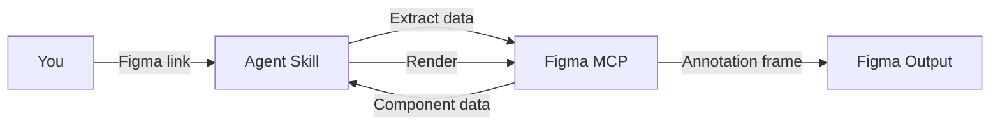

<Frame>
  <video src="/images/specs/api-output.mp4" autoPlay muted loop playsInline alt="Example API spec output in Figma" />
</Frame>

API specs document all configurable properties for a component: values, defaults, required vs. optional, and usage examples. This gives engineers a clear reference for implementing the component.

<Tip>
  The API section also ships as part of the [Component Markdown](/specs/component-md) output. Run `create-component-md` when you want API, structure, color, and voice in a single `.md` file instead of a Figma frame.
</Tip>

## What you need

- A **Figma link** to the component
- **Figma MCP** connected (Console MCP with Desktop Bridge, or native Figma MCP)
- Any additional context about properties, accepted values, or nested component configurations

<Tip>
  Mention which properties are required, what the defaults are, and any sub-components that have their own configuration (e.g., a trailing button inside a section heading).
</Tip>

## How to use

Reference the skill and paste your Figma link. Include context about the component's properties, accepted values, and sub-component configurations for a more accurate spec:

<Tabs>
  <Tab title="Cursor">
    ```
    @create-api https://www.figma.com/design/abc123/Components?node-id=100:200

    This is a section heading with leading content (primary/secondary labels),
    trailing content (text button, icon button, or none), and density options.
    The label is required, subtitle is optional. Default trailing content is none.
    ```
  </Tab>
  <Tab title="Claude Code">
    ```
    /create-api https://www.figma.com/design/abc123/Components?node-id=100:200

    This is a section heading with leading content (primary/secondary labels),
    trailing content (text button, icon button, or none), and density options.
    The label is required, subtitle is optional. Default trailing content is none.
    ```
  </Tab>
  <Tab title="Codex">
    ```
    $create-api https://www.figma.com/design/abc123/Components?node-id=100:200

    This is a section heading with leading content (primary/secondary labels),
    trailing content (text button, icon button, or none), and density options.
    The label is required, subtitle is optional. Default trailing content is none.
    ```
  </Tab>
</Tabs>

## What it generates

The agent inspects your component's variant axes, boolean toggles, content slots, and variable modes, then renders a documentation frame in your Figma file:

| Section | What it covers |
|---------|---------------|
| Main property table | All top-level properties with values, required status, defaults, and notes |
| Sub-component tables | Separate tables for configurable nested elements (e.g., trailing content options) |
| Configuration examples | 1–4 examples showing common setups |

The agent looks at three sources in Figma to find all configurable properties:

- **Variant axes**: properties visible in variant names (size, type, state)
- **Instance properties**: boolean toggles and content options only visible when inspecting a single instance
- **Variable modes**: properties controlled at the container level (shape, density)

<Note>
  Transient interactive states like hover and pressed are not included as API properties. Those are handled at runtime by the platform. Only persistent states like disabled, selected, and loading appear as properties.
</Note>

## How it works

The API skill is heavily AI-driven — the agent classifies properties, determines required vs. optional status, writes descriptions, and designs configuration examples, while deterministic scripts handle template rendering.

<Badge color="green" size="sm" shape="pill">25% Deterministic</Badge> <Badge color="purple" size="sm" shape="pill">75% AI Reasoning</Badge>



<Steps>
  <Step title="Extract">
    The skill reads variant axes, boolean toggles, content slots, and variable modes from the component via the Figma MCP.
  </Step>
  <Step title="Classify properties">
    Each property is categorized as required or optional, and defaults are identified.
  </Step>
  <Step title="Discover sub-components">
    Nested component instances are resolved to find their own configurable properties.
  </Step>
  <Step title="Import template">
    The API documentation template is imported from the library, instantiated, and detached into an editable frame.
  </Step>
  <Step title="Render">
    The skill fills header fields, builds property tables, sub-component tables, and configuration examples.
  </Step>
  <Step title="Validate">
    A screenshot is captured and checked for completeness. Issues are fixed automatically for up to 3 iterations.
  </Step>
</Steps>

<Tip>
The skill renders programmatically, so the output is consistent and repeatable. Running it on the same component produces identical results.
</Tip>

## Tips for better output

- **Describe content slots with multiple options**: if a slot can contain different content types (icon, avatar, image, none), list them explicitly. For example: *"leading content can be an icon, avatar, or image"*
- **Note required vs. optional**: mention which properties must always be set and which have defaults
- **Mention sub-components**: if your component has configurable nested elements (e.g., a trailing button inside a section heading), describe their configuration options
- **Specify defaults**: tell the agent which values are the default configuration
- **Distinguish persistent from transient states**: mention states like `disabled`, `selected`, or `loading` that should become properties. Transient states like hover and pressed are handled at runtime and won't appear in the API
