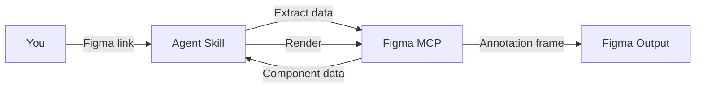

<Frame>
  <video src="/images/specs/color-output.mp4" autoPlay muted loop playsInline alt="Example color annotation output in Figma" />
</Frame>

Color annotation specs document which design tokens are used for backgrounds, text, icons, and state layers across different component states and variants.

<Tip>
  Color also ships as part of the [Component Markdown](/specs/component-md) output. Run `create-component-md` when you want API, structure, color, and voice in a single `.md` file instead of a Figma frame.
</Tip>

## What you need

- A **Figma link** to the component
- **Figma MCP** connected (Console MCP with Desktop Bridge, or native Figma MCP)
- Any additional context about variants, states, or which color modes to include

<Tip>
  If your component uses Figma variable modes for color variants (e.g., a "Tag color" collection with Default, Success, Warning modes), mention it in your prompt. The agent checks for these automatically, but calling them out helps.
</Tip>

## How to use

Reference the skill and paste your Figma link. Include context about states, variants, and variable mode collections for a more complete spec:

<Tabs>
  <Tab title="Cursor">
    ```
    @create-color https://www.figma.com/design/abc123/Components?node-id=100:200

    This is a button with enabled, hovered, pressed, and disabled states.
    Include both Default and Danger variants.
    ```
  </Tab>
  <Tab title="Claude Code">
    ```
    /create-color https://www.figma.com/design/abc123/Components?node-id=100:200

    This is a button with enabled, hovered, pressed, and disabled states.
    Include both Default and Danger variants.
    ```
  </Tab>
  <Tab title="Codex">
    ```
    $create-color https://www.figma.com/design/abc123/Components?node-id=100:200

    This is a button with enabled, hovered, pressed, and disabled states.
    Include both Default and Danger variants.
    ```
  </Tab>
</Tabs>

## What it generates

The agent inspects your component's fills, strokes, and variables, then maps every color-bearing element to its design token and renders the documentation directly in your Figma file.

### How the output is organized

The structure depends on your component type:

<Tabs>
  <Tab title="Static content">
Components without interactive states (headers, cards, labels) get a single table mapping each element to its token.
  </Tab>
  <Tab title="Interactive">
Components with states (buttons, checkboxes, inputs) get a separate table per state showing how tokens change across enabled, hovered, pressed, and disabled.
  </Tab>
  <Tab title="Multi-variant">
Components with style or color variants (default + danger, primary + secondary) get separate variant sections, each with their own state tables.
  </Tab>
  <Tab title="Variable mode">
Components where color is controlled by a Figma variable collection (tag colors, badge styles, emphasis levels) get one section per mode value.
  </Tab>
</Tabs>

<Note>
  Light and dark themes don't need separate documentation. Semantic tokens handle theme switching automatically.
</Note>

## How it works

The color skill balances deterministic token extraction and table rendering with AI reasoning for variant organization, state mapping, and sub-component analysis.

<Badge color="green" size="sm" shape="pill">55% Deterministic</Badge> <Badge color="purple" size="sm" shape="pill">45% AI Reasoning</Badge>



<Steps>
  <Step title="Extract">
    The skill reads fills, strokes, and variable bindings from the component via the Figma MCP.
  </Step>
  <Step title="Map tokens">
    Each color-bearing element is matched to its design token, across all states and variants.
  </Step>
  <Step title="Detect variable modes">
    Variable collections (tag color, badge style) are identified and each mode gets its own section.
  </Step>
  <Step title="Import template">
    The color documentation template is imported from the library, instantiated, and detached into an editable frame.
  </Step>
  <Step title="Render">
    The skill fills header fields, builds state tables, variant sections, and variable mode sections.
  </Step>
  <Step title="Validate">
    A screenshot is captured and checked for completeness. Issues are fixed automatically for up to 3 iterations.
  </Step>
</Steps>

<Tip>
The skill renders programmatically, so the output is consistent and repeatable. Running it on the same component produces identical results.
</Tip>

## Tips for better output

- **List all states**: enabled, hovered, pressed, disabled. The agent maps tokens per state
- **Mention color variants**: if your component has Default and Danger (or similar), describe both
- **Call out variable mode collections**: if color is controlled by a Figma variable collection (e.g., *"Tag color"* with Default, Success, Warning, Error modes), name the collection and its modes in your prompt. The agent checks for these automatically, but explicit mention ensures nothing is missed
- **Note sub-components**: if your component contains another component (e.g., a Button inside a Section heading), the agent references it instead of duplicating its tokens
