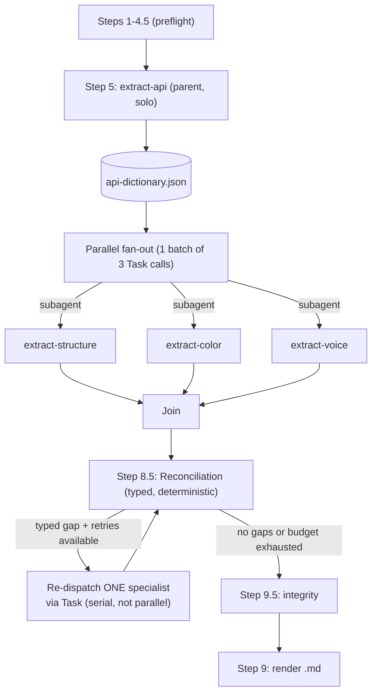

<Frame>
  
</Frame>

`create-component-md` produces one markdown file per component, covering API, structure, color, and screen-reader behavior. The file is the artifact: LLM tools can build from it, and humans can query it. The other uSpec skills render documentation back into Figma; this one writes a portable spec to disk.

<Info>
The `.md` output works with any LLM workflow: Claude in Cursor, Claude Design, GPT agents, Gemini, local models, and anything else that reads Markdown.
</Info>

## What it generates

A single `components/{componentSlug}.md` file with five sections:

| Section | Content |
|---------|---------|
| Overview | Component name, variant axes summary, and composition (constitutive and referenced children) |
| API | Properties, values, defaults, required vs. optional, sub-component tables, and configuration examples |
| Structure | Dimensions, spacing, padding, and sub-component variant walks across every size and density |
| Color | Per-element token mapping for fills, strokes, and effects across every variant |
| Voice / Screen reader | Focus order, merge analysis, and platform tables for VoiceOver, TalkBack, and ARIA |

A Provenance block at the bottom records the Figma file key, node id, cache location, and generation timestamp so every claim in the spec is traceable back to the source.

## What you need

This skill runs in two steps: extract, then generate. You need both pieces set up once.

<Steps>
  <Step title="Install the uSpec Extract plugin">
    The plugin produces a `_base.json` file that captures every variant, token binding, and sub-component in one pass. Build it locally and import it into Figma Desktop.

    <Note>
      `npx uspec-skills` installs only the AI skills into your project. The Figma plugin is a separate piece that has to live inside Figma Desktop. Cloning the uSpec repo is the supported way to get the plugin source today.
    </Note>

    <Steps>
      <Step title="Clone the uSpec repository">
        Clone uSpec anywhere on your machine — it does **not** need to be inside the project where you ran `npx uspec-skills init`. The plugin only needs to live somewhere Figma Desktop can reach to import the manifest.

        ```bash
        git clone https://github.com/redongreen/uSpec.git
        cd uSpec/figma-plugin
        ```
      </Step>
      <Step title="Build the plugin">
        ```bash
        npm install
        npm run build
        ```

        This produces `dist/code.js` and `dist/ui.html` next to the manifest. Both files are required for the import in the next step.
      </Step>
      <Step title="Import the manifest">
        In Figma Desktop, go to **Plugins → Development → Import plugin from manifest…** and select `uSpec/figma-plugin/manifest.json` from your local clone.
      </Step>
      <Step title="Run from the Development menu">
        The plugin now appears under **Plugins → Development → uSpec Extract**.
      </Step>
    </Steps>

    <Tip>
      The plugin runs entirely inside Figma's plugin sandbox. No network calls, no account required, nothing leaves your machine.
    </Tip>

    <Note>
      For Node version requirements, the watch-mode dev loop, and common failure modes, see the [Figma Extract plugin troubleshooting tab](/help/troubleshooting).
    </Note>
  </Step>
  <Step title="Set up uSpec">
    You also need the `create-component-md` skill. From your project root, run `npx uspec-skills init` and choose your agent host (Cursor, Claude Code, or Codex). The CLI installs every skill — including `create-component-md` — into the platform-specific directory. If you have not set up your agent host yet, follow [Getting Started](/getting-started). The Component Markdown path does not require Figma MCP setup or `firstrun` — those are only needed for the Figma-native skills.
  </Step>
</Steps>

## How to use

<Warning>
This skill uses parallel agents and runs the equivalent of four specs in one pass. We recommend running it on **Opus 4.7 High** or better. A typical run costs **50k–200k tokens** depending on component complexity. Start a fresh agent session for each run so the model has full context capacity.
</Warning>

<Steps>
  <Step title="Extract the component">
    In Figma:

    1. Select a single `COMPONENT` or `COMPONENT_SET`. Selecting a variant auto-promotes to its component set.
    2. Run **Plugins → uSpec Extract** (or **Plugins → Development → uSpec Extract** if you dev-installed).
    3. Review the sub-component checklist. The plugin pre-guesses whether each child is **constitutive** (owned by this component) or **referenced** (an instance of a widely-reused component). Flip any guess you disagree with.
    4. Optionally paste design intent, open questions, or constraints into the text area.
    5. Click **Extract & download** to save `{componentSlug}-_base.json` to `~/Downloads/`, or **Copy JSON** to put the full payload on your clipboard.
  </Step>
  <Step title="Run the skill">
    In your agent host, point the skill at the downloaded file:

    <Tabs>
      <Tab title="Cursor">
        ```
        @create-component-md baseJsonPath=~/Downloads/text-field-_base.json
        ```
      </Tab>
      <Tab title="Claude Code">
        ```
        /create-component-md baseJsonPath=~/Downloads/text-field-_base.json
        ```
      </Tab>
      <Tab title="Codex">
        ```
        $create-component-md baseJsonPath=~/Downloads/text-field-_base.json
        ```
      </Tab>
    </Tabs>

    The agent validates the JSON, runs four interpretation sub-skills, reconciles their outputs, and writes `./components/{componentSlug}.md` under your current working directory.
  </Step>
</Steps>

<Check>
When the run finishes, a new `.md` appears under `./components/` in the working directory (e.g., `components/text-field.md`). Open it to verify the five sections are populated and the Provenance block at the bottom references your Figma file.
</Check>

### Optional: pair with a Figma link

If you pass a Figma URL alongside the JSON, the agent can run a targeted measurement delta when a sub-skill flags a gap:

```
@create-component-md baseJsonPath=~/Downloads/text-field-_base.json figmaLink=https://www.figma.com/design/abc123/…
```

This is rarely needed. The plugin captures everything required for a complete spec on its own.

## How it works

The skill runs a four-way interpretation pipeline against the `_base.json` produced by the extractor. The deterministic reconciliation loop catches cross-section disagreements before the `.md` is written.

<Badge color="green" size="sm" shape="pill">Deterministic extraction</Badge> <Badge color="blue" size="sm" shape="pill">Parallel AI interpretation</Badge> <Badge color="purple" size="sm" shape="pill">Reconciliation gate</Badge>



<Steps>
  <Step title="Preflight">
    The orchestrator validates `_base.json` against the plugin schema, stages it into `.uspec-cache/{componentSlug}/`, and reviews any designer-in-the-loop classifications from the plugin.
  </Step>
  <Step title="API dictionary (solo)">
    `extract-api` runs first, inline in the parent context. It produces the component's property dictionary and writes `api-dictionary.json`. The dictionary keeps the three downstream specialists aligned on property names and state vocabularies.
  </Step>
  <Step title="Parallel fan-out">
    The orchestrator dispatches `extract-structure`, `extract-color`, and `extract-voice` as three parallel subagents in a single batch. Each specialist holds its own `_base.json` and dictionary context; the parent only keeps the returned summaries.
  </Step>
  <Step title="Reconciliation">
    The orchestrator compares the three specialist artifacts for typed disagreements (conflicting child classifications, mismatched axes, missing states). When the `reconciliation.autoRetry` flag is on, the offending specialist is re-dispatched with the mismatch attached, up to a bounded retry count.
  </Step>
  <Step title="Integrity check">
    Before rendering, the orchestrator validates every cache file's shape, cross-checks axis consistency, and confirms the structure coverage matrix is complete.
  </Step>
  <Step title="Render">
    The renderer fills a single Markdown template with the reconciled data and writes `components/{componentSlug}.md` to disk.
  </Step>
</Steps>

<Tip>
The pipeline is deterministic given the same `_base.json`. If you re-extract without changes and re-run the skill, the generated `.md` is identical to the last run. Diffs between runs reflect real design changes.
</Tip>

## Using the output with LLMs

The generated `.md` is self-contained. Hand it to any LLM as context and ask it to:

- Implement the component in React, SwiftUI, Jetpack Compose, or your platform of choice.
- Generate unit tests that cover every documented state and variant.
- Write platform-specific accessibility code from the Voice section tables.
- Build a Storybook file with one story per variant axis value.
- Create a design-review checklist from the Known gaps block.

The spec names every property, every token, and every dimension directly, so the downstream LLM does not need to read Figma or guess at intent.

<Tip>
Commit the generated `.md` to your design system repository alongside the component code. When the component changes in Figma, re-run the extractor and the skill to produce a new `.md`, then diff against the committed one to see what changed.
</Tip>

## What the plugin captures

The extractor walks every variant and resolves every binding, which is what makes the `.md` pixel-perfect:

- **Every variant.** No default-variant sampling. Cross-variant diffs and axis classification are computed inside the plugin sandbox.
- **Library-linked variables** with name, `codeSyntax`, alias chains, and remote collection metadata.
- **Inline font properties** alongside text style IDs, so typography survives when a library style cannot be resolved.
- **Sub-components walked across their own variant axes.** A Button inside a Text Field is measured across its own size and density variants, not only the configuration the parent embeds.
- **Designer-in-the-loop classification.** You confirm or flip whether each top-level child is constitutive, referenced, or decorative before extraction runs.

See the [plugin schema reference](https://github.com/redongreen/uSpec/blob/main/figma-plugin/docs/base-json-schema.md) for the complete `_base.json` contract.

## Tips for better output

- **Use Opus 4.7 High or better.** Lower-capacity models may truncate mid-reconciliation and leave one of the four sections incomplete.
- **Start a fresh agent session for every run.** Accumulated history reduces available context. This skill uses parallel subagents and works best with a clean session.
- **Review the plugin's sub-component checklist carefully.** The downstream spec inherits your classifications. Getting constitutive vs referenced right saves reconciliation cycles.
- **Add design intent in the plugin's text area** when a component has behavior that is not visible in the static design: focus-order intent, conditional states, or platform-specific variants.
- **Run the plugin on the component set**, not a single variant. The plugin auto-promotes selected variants to their set, but starting from the set makes the axes explicit.
- **Diff the `.md` between runs.** After a design change, re-extract and re-generate. The resulting diff is a clean record of what changed semantically, not just pixel-wise.

## Troubleshooting

The accordions below cover issues with the generated `.md` itself. For plugin install or build issues — Figma can't find the plugin, `npm run build` fails, the canvas selection is rejected — see the [Figma Extract plugin troubleshooting tab](/help/troubleshooting).

<AccordionGroup>
  <Accordion title="Validation error: _base.json does not match schema">
    The plugin output failed Ajv schema validation.

    - Confirm the plugin version matches the skill version. If you updated one without the other, the schema can drift.
    - Re-run the plugin and try again.
    - If the problem persists, run the validator directly to see the full diagnostic:

    ```bash
    node figma-plugin/scripts/validate-base.mjs ~/Downloads/your-component-_base.json
    ```
  </Accordion>
  <Accordion title="The generated .md has `—` in structure cells">
    The structure section renders `—` when the plugin could not measure a sub-component variant.

    - Confirm the sub-component checklist in the plugin marks the missing child as **constitutive**. Referenced children intentionally skip deep measurement.
    - If the sub-component has more than 20 variant combinations, the extractor caps the walk and emits a `skipped` marker. For very large sub-components, document them in their own `create-component-md` run and reference the resulting file.
  </Accordion>
  <Accordion title="One section (e.g., Voice) is noticeably shorter than the others">
    A specialist may have hit a reconciliation budget limit.

    - Check the Known gaps block at the top of the `.md`. Unresolved reconciliation items are listed there.
    - Re-run on a higher-capacity model, or re-run with `reconciliation.autoRetry` set to `true` in `uspecs.config.json`.
  </Accordion>
  <Accordion title="Token cost is higher than 200k">
    Very complex components (many variants, many sub-components, or large property matrices) can exceed the typical range.

    - Break the component into smaller units and spec them separately.
    - For compound components, spec the parent and reference the children rather than re-specifying each child inline.
  </Accordion>
</AccordionGroup>

## Related

<CardGroup cols={2}>
  <Card title="Getting Started" icon="rocket" href="/getting-started">
    Install your agent host (Cursor, Claude Code, or Codex). The Component Markdown path skips MCP and template library setup.
  </Card>
  <Card title="How It Works" icon="diagram-project" href="/how-it-works">
    See the two rendering paths uSpec supports and where this skill fits.
  </Card>
  <Card title="Plugin troubleshooting" icon="puzzle-piece" href="/help/troubleshooting">
    Build, install, and recovery instructions for the uSpec Extract plugin.
  </Card>
  <Card title="Screen reader spec" icon="universal-access" href="/specs/screen-reader">
    Render VoiceOver, TalkBack, and ARIA tables directly into Figma.
  </Card>
</CardGroup>
