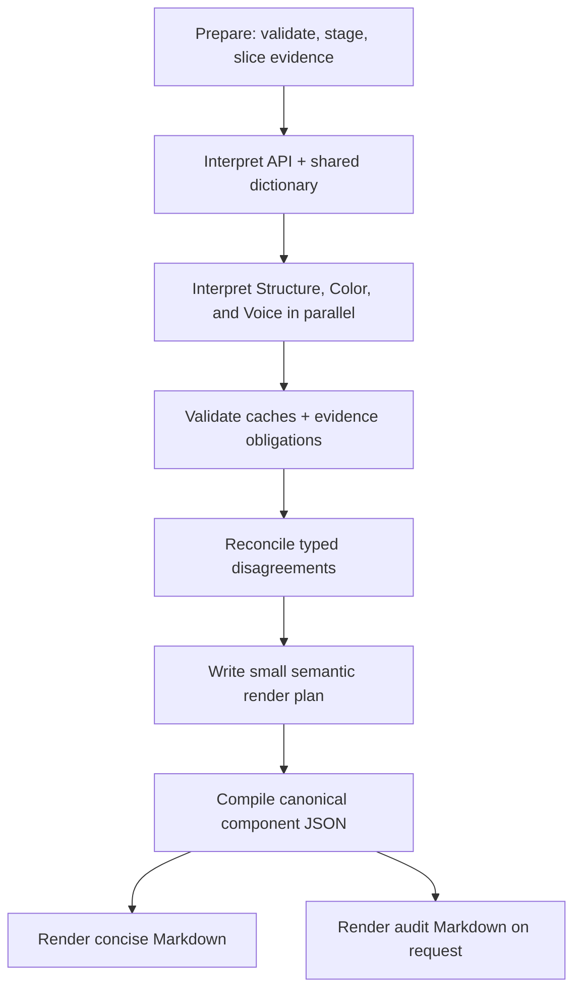

<Frame>
  
</Frame>

`create-component-md` produces a canonical JSON contract and a sibling Markdown implementation
guide for each component, covering API, structure, color, and screen-reader behavior. LLM tools and
automation can consume the JSON; humans can query the concise `.md`. The other uSpec skills render
sections of that specification back into Figma.

<Info>
The `.md` output works with any LLM workflow: Claude in Cursor, Claude Design, GPT agents, Gemini,
local models, and anything else that reads Markdown. Use the canonical `.json` when you need a
validated machine contract.
</Info>

## What it generates

Each run writes two tracked artifacts:

- `components/{componentSlug}.json` — the canonical, schema-valid machine contract
- `components/{componentSlug}.md` — the concise implementation guide rendered from that contract

Pass `--view audit` to the renderer when you need an exhaustive
`components/{componentSlug}.audit.md` diagnostic companion.

The concise Markdown contains five sections:

| Section | Content |
|---------|---------|
| Overview | Component name, variant axes summary, and composition (constitutive and referenced children) |
| API | Properties, values, defaults, required vs. optional, sub-component tables, and configuration examples |
| Structure | An Anatomy layer tree at the top, then dimensions, spacing, padding, and sub-component variant walks across every size and density |
| Color | Per-element token mapping for fills, strokes, and effects across every variant |
| Voice / Screen reader | Focus order, merge analysis, and platform tables for VoiceOver, TalkBack, and ARIA |

A Provenance block records the source identity and evidence coverage so every claim is traceable
back to the extraction without exposing pipeline internals in the human-readable body.

## What you need

This skill runs in two steps: extract, then generate. You need both pieces set up once.

<Steps>
  <Step title="Install the uSpec Extract plugin">
    The plugin produces a `_base.json` file that captures every variant, token binding, and sub-component in one pass. It is published on the Figma Community, so there is no local build.

    <Steps>
      <Step title="Open the Community plugin">
        Go to [uSpec Extract](https://www.figma.com/community/plugin/1635184425006534227/uspec-extract) on the Figma Community.
      </Step>
      <Step title="Install it">
        Click **Open in…** (or **Try it out**) to add it to your Figma. It then appears under **Plugins → uSpec Extract** in any file.
      </Step>
    </Steps>

    <Tip>
      The plugin runs entirely inside Figma's plugin sandbox. No network calls, no account required, nothing leaves your machine.
    </Tip>

    <Note>
      The public Community plugin requires the selected component's Figma link because public
      plugins cannot rely on the file key API. Paste it on the first run; the plugin remembers it
      for later runs in the same document.
    </Note>

    <Note>
      The plugin is open source. If you want to read or modify the source, it lives in [`figma-plugin/`](https://github.com/redongreen/uSpec/tree/main/figma-plugin); the [troubleshooting guide](/help/troubleshooting) covers building from source and common failure modes.
    </Note>
  </Step>
  <Step title="Set up uSpec">
    You also need the `create-component-md` skill. From your project root, run `npx uspec-skills init` and choose your agent host (Cursor, Claude Code, or Codex). The CLI installs every skill — including `create-component-md` — into the platform-specific directory. If you have not set up your agent host yet, follow [Getting Started](/getting-started). Generating the `.md` does not require Figma MCP setup or `firstrun` — those are only needed for the `create-*` skills that render the `.md` back into Figma.
  </Step>
</Steps>

## How to use

<Warning>
This skill uses parallel agents and runs the equivalent of four specs in one pass. We recommend running it on **Opus 4.7 High** or better. A typical run costs **50k–200k tokens** depending on component complexity. Start a fresh agent session for each run so the model has full context capacity.
</Warning>

<Steps>
  <Step title="Extract the component">
    In Figma:

    1. Select a single `COMPONENT` or `COMPONENT_SET`. Selecting a variant auto-promotes to its component set.
    2. Run **Plugins → uSpec Extract** (or **Plugins → Development → uSpec Extract** if you dev-installed).
    3. Paste the selected component's Figma link into the footer.
    4. Review the sub-component checklist. The plugin pre-guesses whether each child is **constitutive** (owned by this component) or **referenced** (an instance of a widely-reused component). Flip any guess you disagree with.
    5. Optionally paste design intent, open questions, or constraints into the text area.
    6. Click **Extract & download** to save `{componentSlug}-_base.json` to `~/Downloads/`, or **Copy JSON** to put the full payload on your clipboard.
  </Step>
  <Step title="Run the skill">
    In your agent host, point the skill at the downloaded file:

    <Tabs>
      <Tab title="Cursor">
        ```
        @create-component-md baseJsonPath=~/Downloads/text-field-_base.json
        ```
      </Tab>
      <Tab title="Claude Code">
        ```
        /create-component-md baseJsonPath=~/Downloads/text-field-_base.json
        ```
      </Tab>
      <Tab title="Codex">
        ```
        $create-component-md baseJsonPath=~/Downloads/text-field-_base.json
        ```
      </Tab>
    </Tabs>

    The agent validates the extraction, runs four interpretation passes, reconciles their outputs,
    compiles the canonical contract, and writes `./components/{componentSlug}.json` plus
    `./components/{componentSlug}.md`.
  </Step>
</Steps>

<Check>
When the run finishes, sibling `.json` and `.md` files appear under `./components/` (for example,
`components/text-field.json` and `components/text-field.md`). Open the Markdown to verify the five
sections, then keep both files together in version control.
</Check>

### Optional: pair with a Figma link

If you pass a Figma URL alongside the JSON, the agent can run a targeted measurement delta when a sub-skill flags a gap:

```
@create-component-md baseJsonPath=~/Downloads/text-field-_base.json figmaLink=https://www.figma.com/design/abc123/…
```

This is rarely needed. The plugin captures everything required for a complete spec on its own.

## How it works

The pipeline separates measured evidence, AI interpretation, and deterministic compilation. This
keeps semantic judgment where it is useful while making validation and final rendering repeatable.

<Badge color="green" size="sm" shape="pill">Deterministic evidence</Badge> <Badge color="blue" size="sm" shape="pill">Parallel interpretation</Badge> <Badge color="purple" size="sm" shape="pill">Validated contract</Badge>


```mermaid
flowchart TB
    Prepare["Prepare: validate, stage, slice evidence"] --> API["Interpret API + shared dictionary"]
    API --> FanOut["Interpret Structure, Color, and Voice in parallel"]
    FanOut --> Validate["Validate caches + evidence obligations"]
    Validate --> Recon["Reconcile typed disagreements"]
    Recon --> Plan["Write small semantic render plan"]
    Plan --> Contract["Compile canonical component JSON"]
    Contract --> Concise["Render concise Markdown"]
    Contract --> Audit["Render audit Markdown on request"]
```

<Steps>
  <Step title="Prepare deterministic evidence">
    `component-md prepare` validates `_base.json`, stages it under
    `.uspec-cache/{componentSlug}/`, and writes a manifest plus API, Structure, Color, Voice, and
    renderer evidence slices. Each slice includes obligations that identify facts the specialist
    must account for.
  </Step>
  <Step title="Interpret the component">
    `extract-api` builds the shared property dictionary first. Structure, Color, and Voice then run
    in parallel against their compact evidence slices and the same vocabulary.
  </Step>
  <Step title="Validate and reconcile">
    `component-md validate` checks each specialist cache, its obligation ledger, source identity,
    semantic row support, and output targets. The orchestrator then compares the domains for typed
    disagreements and can retry only the specialist that owns a mismatch.
  </Step>
  <Step title="Compile the canonical contract">
    The parent writes a small semantic render plan containing the overview and confidence summary.
    `component-md contract` combines that plan with validated caches into
    `components/{componentSlug}.json`.
  </Step>
  <Step title="Render the human view">
    `component-md render` mechanically produces the concise implementation guide from the contract
    and runs acceptance gates over every domain. Use `--view audit` when you need exhaustive
    evidence, provenance, and target diagnostics.
  </Step>
</Steps>

<Tip>
Given the same extraction, validated specialist caches, and render plan, contract compilation and
Markdown rendering are deterministic. Diffs in those artifacts reflect source or interpretation
changes rather than formatting drift.
</Tip>

## Using the output with LLMs

The generated `.md` is self-contained for human and LLM implementation work. Hand it to any LLM
as context and ask it to:

- Implement the component in React, SwiftUI, Jetpack Compose, or your platform of choice.
- Generate unit tests that cover every documented state and variant.
- Write platform-specific accessibility code from the Voice section tables.
- Build a Storybook file with one story per variant axis value.
- Create a design-review checklist from the Known gaps block.

The spec names every property, every token, and every dimension directly, so the downstream LLM does not need to read Figma or guess at intent.

<Tip>
Commit the generated `.json` and `.md` together alongside the component code. When the component
changes in Figma, re-run the extractor and the skill, then diff both artifacts to see what changed.
</Tip>

## What the plugin captures

The extractor walks every variant and resolves every binding, which is what makes the `.md` pixel-perfect:

- **Every variant.** No default-variant sampling. Cross-variant diffs and axis classification are computed inside the plugin sandbox.
- **Variant-complete composition.** Child instances carry exact per-variant presence and placement
  metadata, including children that only exist outside the default variant.
- **Distinct revealed topologies.** Every structural topology gets a populated revealed-tree
  representative, so state- or variant-specific anatomy remains available downstream.
- **Library-linked variables** with name, `codeSyntax`, alias chains, and remote collection metadata.
- **Inline font properties** alongside text style IDs, so typography survives when a library style cannot be resolved.
- **Sub-components walked across their own variant axes.** A Button inside a Text Field is measured across its own size and density variants, not only the configuration the parent embeds.
- **Designer-in-the-loop classification.** You confirm or flip whether each top-level child is constitutive, referenced, or decorative before extraction runs.

See the [plugin schema reference](https://github.com/redongreen/uSpec/blob/main/figma-plugin/docs/base-json-schema.md) for the complete `_base.json` contract.

## Tips for better output

- **Use Opus 4.7 High or better.** Lower-capacity models may truncate mid-reconciliation and leave one of the four sections incomplete.
- **Start a fresh agent session for every run.** Accumulated history reduces available context. This skill uses parallel subagents and works best with a clean session.
- **Review the plugin's sub-component checklist carefully.** The downstream spec inherits your classifications. Getting constitutive vs referenced right saves reconciliation cycles.
- **Add design intent in the plugin's text area** when a component has behavior that is not visible in the static design: focus-order intent, conditional states, or platform-specific variants.
- **Run the plugin on the component set**, not a single variant. The plugin auto-promotes selected variants to their set, but starting from the set makes the axes explicit.
- **Diff the `.md` between runs.** After a design change, re-extract and re-generate. The resulting diff is a clean record of what changed semantically, not just pixel-wise.

## Troubleshooting

The accordions below cover issues with the generated `.md` itself. For plugin install or runtime issues — Figma can't find the plugin, the canvas selection is rejected, the export produces no file — see the [Figma Extract plugin troubleshooting tab](/help/troubleshooting).

<AccordionGroup>
  <Accordion title="Validation error: _base.json does not match schema">
    The plugin output failed Ajv schema validation during the CLI prepare stage.

    - Confirm the plugin version matches the skill version. If you updated one without the other, the schema can drift.
    - Re-run the plugin and try again.
    - Run the prepare command directly to see the full diagnostic:

    ```bash
    npx uspec-skills component-md prepare --base ~/Downloads/your-component-_base.json --json
    ```

    Contributors running from source can also use:

    ```bash
    node figma-plugin/scripts/validate-base.mjs ~/Downloads/your-component-_base.json
    ```
  </Accordion>
  <Accordion title="The generated .md has `—` in structure cells">
    The structure section renders `—` when the plugin could not measure a sub-component variant.

    - Confirm the sub-component checklist in the plugin marks the missing child as **constitutive**. Referenced children intentionally skip deep measurement.
    - If the sub-component has more than 20 variant combinations, the extractor caps the walk and emits a `skipped` marker. For very large sub-components, document them in their own `create-component-md` run and reference the resulting file.
  </Accordion>
  <Accordion title="One section (e.g., Voice) is noticeably shorter than the others">
    A specialist may have hit a reconciliation budget limit.

    - Check the Known gaps block at the top of the `.md`. Unresolved reconciliation items are listed there.
    - Re-run on a higher-capacity model, or re-run with `reconciliation.autoRetry` set to `true` in `uspecs.config.json`.
  </Accordion>
  <Accordion title="Token cost is higher than 200k">
    Very complex components (many variants, many sub-components, or large property matrices) can exceed the typical range.

    - Break the component into smaller units and spec them separately.
    - For compound components, spec the parent and reference the children rather than re-specifying each child inline.
  </Accordion>
</AccordionGroup>

## Related

<CardGroup cols={2}>
  <Card title="Getting Started" icon="rocket" href="/getting-started">
    Install your agent host (Cursor, Claude Code, or Codex). Generating the `.md` skips MCP and template library setup.
  </Card>
  <Card title="How It Works" icon="diagram-project" href="/how-it-works">
    See the uSpec pipeline and where this skill fits as the source of truth.
  </Card>
  <Card title="Plugin troubleshooting" icon="puzzle-piece" href="/help/troubleshooting">
    Install and recovery instructions for the uSpec Extract plugin.
  </Card>
  <Card title="Screen reader spec" icon="universal-access" href="/specs/screen-reader">
    Render VoiceOver, TalkBack, and ARIA tables directly into Figma.
  </Card>
</CardGroup>
