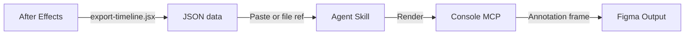

<Frame>
  <video src="/images/specs/motion-output.mp4" autoPlay muted loop playsInline alt="Example motion specification output in Figma" />
</Frame>

The motion skill documents a component's animation behavior — every animated property gets a timeline bar and an entry in a detail table showing easing, duration, and value transitions.

<Info>
The motion spec currently only supports extraction from **After Effects**. Unlike other skills that work directly from a Figma link, this is a **two-step process**: first run the export script in After Effects to get the JSON data, then run the skill with that output.
</Info>

## What you get

<CardGroup cols={2}>
  <Card title="Timeline visualization" icon="chart-gantt">
    Color-coded bars for each animated property, positioned on a time ruler. Blue for Bezier easing, green for Linear, and teal for Hold.
  </Card>
  <Card title="Motion details table" icon="table">
    A 7-column table with element, property, from/to values, duration, delay, and easing curve for every animation segment.
  </Card>
  <Card title="Time ruler" icon="ruler-horizontal">
    Millisecond tick marks aligned to the timeline bars, scaled to the composition duration.
  </Card>
  <Card title="Composition header" icon="circle-info">
    Component name, duration, frame rate, and dimensions at the top of the annotation.
  </Card>
</CardGroup>

Bar labels show value transitions (e.g., "0% -> 115%") while easing type is communicated through bar color and detailed in the table. A color legend at the bottom maps Bezier, Linear, and Hold to their bar colors.

## What you need

- **After Effects** with the composition open
- The **`export-timeline.jsx`** script (included in the `motion/` folder)
- **Figma Console MCP** connected via the Desktop Bridge plugin
- Optionally, a **Figma destination link** to place the annotation on a specific page

## How to use

<Steps>
  <Step title="Export from After Effects">
    Open your composition in After Effects and run the export script:

    **File > Scripts > Run Script** and select `motion/export-timeline.jsx`

    The script extracts all animated properties, computes easing curves, filters out static segments, and copies the result to your clipboard as JSON.

    <Note>
    Make sure **"Allow Scripts to Write Files and Access Network"** is enabled in After Effects preferences under Scripting & Expressions.
    </Note>
  </Step>
  <Step title="Run the skill">
    Reference the `create-motion` skill, provide the JSON data (pasted directly or as a file reference), and include a Figma link to the destination page:

    <Tabs>
      <Tab title="Cursor">
        ```
        @create-motion <paste JSON here>
        https://www.figma.com/design/abc123/Specs?node-id=0-1
        ```

        Or with a file reference:

        ```
        @create-motion @motion-data.json
        https://www.figma.com/design/abc123/Specs?node-id=0-1
        ```
      </Tab>
      <Tab title="Claude Code">
        ```
        /create-motion <paste JSON here>
        https://www.figma.com/design/abc123/Specs?node-id=0-1
        ```
      </Tab>
      <Tab title="Codex">
        ```
        $create-motion <paste JSON here>
        https://www.figma.com/design/abc123/Specs?node-id=0-1
        ```
      </Tab>
    </Tabs>
  </Step>
</Steps>

## What it generates

| Output | Description |
|--------|-------------|
| Composition header | Component name, "Motion Specification" label, and metadata (duration, fps, dimensions) |
| Time ruler | Tick marks at regular intervals scaled to the composition duration |
| Timeline layers | One row per animated layer, with sub-rows for each property (Scale, Opacity, etc.) |
| Timeline bars | Color-coded bars positioned on the time axis, labeled with value transitions |
| Color legend | Bezier, Linear, and Hold easing types mapped to their bar colors |
| Detail table | One row per animation segment with element, property, from, to, duration, delay, and easing |

Only layers with actual animation are included. The export script filters out segments where values don't change, so the output shows only meaningful transitions.

## How it works



<Steps>
  <Step title="Export">
    The `export-timeline.jsx` script walks every layer in the active composition, pairs keyframes into segments, computes cubic-bezier easing values, formats display labels, and filters out no-change segments. The output is self-contained JSON with all display values pre-computed.
  </Step>
  <Step title="Parse and validate">
    The agent validates the JSON structure: composition metadata, layer array, property segments, and required fields like `startMs`, `durationMs`, `barLabel`, and `easingType`.
  </Step>
  <Step title="Compute layout">
    Track width and tick spacing are computed from the composition duration. The time ruler and all track areas are resized to match.
  </Step>
  <Step title="Import template">
    The motion documentation template is imported from the library, instantiated, and detached into an editable frame.
  </Step>
  <Step title="Render timeline">
    For each animated layer, the skill clones a layer template, sets the layer name, then clones property rows with positioned and colored bars. Bar positions are computed from the pre-computed segment timing data.
  </Step>
  <Step title="Render table">
    One row is cloned per animation segment, filling in element name, property, from/to values, duration, delay, and easing curve.
  </Step>
  <Step title="Validate">
    A screenshot is captured and checked for completeness. Issues are fixed automatically for up to 3 iterations.
  </Step>
</Steps>

<Tip>
Unlike other skills that extract data from Figma, the motion skill reads pre-computed data from After Effects. The export script does all the heavy lifting — pairing keyframes, computing easing curves, and formatting labels. The agent reads the segments directly and only computes layout values.
</Tip>

## Tips for better output

- **Name your layers in After Effects**: Layer names become the element labels in the timeline and detail table. Descriptive names like "Check" or "Selected fill" produce much better documentation than "Layer 1" or "Shape Layer 3"
- **Ensure keyframes exist**: The export script only captures properties with keyframes. Static properties are excluded automatically
- **Check the composition duration**: The timeline scales to the full composition length. Trim your composition to the relevant animation range for a tighter, more readable spec
- **Re-export if validation fails**: If the agent reports missing fields, re-run `export-timeline.jsx` in After Effects. The script copies fresh JSON to your clipboard
- **One composition at a time**: The script exports the active composition. Switch compositions in After Effects before re-running the script
