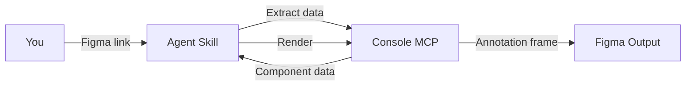

<Frame>
  <video src="/images/specs/property-output.mp4" autoPlay muted loop playsInline alt="Example property annotation output in Figma" />
</Frame>

The property skill documents every configurable property of a component — variant axes, boolean toggles, variable modes, and child component properties — each shown as a visual exhibit with live instance previews.

## What you get

<CardGroup cols={2}>
  <Card title="Variant axis exhibits" icon="sliders">
    One section per axis (e.g., Size, Hierarchy) with instance previews for every option.
  </Card>
  <Card title="Boolean toggle exhibits" icon="toggle-on">
    On/off states shown side by side with defaults labeled.
  </Card>
  <Card title="Variable mode properties" icon="swatchbook">
    Shape, density, and other variable-mode properties rendered as visual chapters.
  </Card>
  <Card title="Child component chapters" icon="diagram-project">
    Nested component properties shown in-context on parent instances.
  </Card>
</CardGroup>

## What you need

- A **Figma link** to a component set or standalone component
- **Figma Console MCP** connected via the Desktop Bridge plugin

## How to use

Reference the skill and paste your Figma link. Add any context about the component to help the agent label properties correctly:

<Tabs>
  <Tab title="Cursor">
    ```
    @create-property https://www.figma.com/design/abc123/Components?node-id=100:200

    This is a button with Size (Large, Medium, Small), Hierarchy (Primary, Secondary, Tertiary),
    and optional leading/trailing icons.
    ```
  </Tab>
  <Tab title="Claude Code">
    ```
    /create-property https://www.figma.com/design/abc123/Components?node-id=100:200

    This is a button with Size (Large, Medium, Small), Hierarchy (Primary, Secondary, Tertiary),
    and optional leading/trailing icons.
    ```
  </Tab>
  <Tab title="Codex">
    ```
    $create-property https://www.figma.com/design/abc123/Components?node-id=100:200

    This is a button with Size (Large, Medium, Small), Hierarchy (Primary, Secondary, Tertiary),
    and optional leading/trailing icons.
    ```
  </Tab>
</Tabs>

<Tip>
  To place the annotation in a different file or page, add a destination link to your prompt:
  `Destination: https://www.figma.com/design/xyz789/Docs?node-id=0-1`
</Tip>

## What it generates

| Output | Description |
|--------|-------------|
| Variant axis exhibits | One section per axis with instance previews for every option |
| Boolean toggle exhibits | On/off states shown side by side |
| Variable mode exhibits | Shape, density, and other variable-driven properties |
| Child component chapters | Nested component properties rendered on parent instances |
| Default labels | The default value for each property is labeled |

The skill dynamically reads `componentPropertyDefinitions` from the component set, so the output adapts to any component regardless of how many properties it has.

## How it works



<Steps>
  <Step title="Extract">
    The skill reads `componentPropertyDefinitions`, `variantProperties`, and child layer data from the component set via the Console MCP.
  </Step>
  <Step title="Detect variable modes">
    Variable collections (shape, density) are identified by looking for collections named after the component.
  </Step>
  <Step title="Discover child components">
    Nested component instances are resolved to find their own configurable properties (variant axes, booleans, instance swaps).
  </Step>
  <Step title="Normalize">
    Coupled axes, container-gated booleans, unified slots, and sibling booleans are consolidated to avoid redundant exhibits.
  </Step>
  <Step title="Import template">
    The property documentation template is imported from the library, instantiated, and detached into an editable frame.
  </Step>
  <Step title="Render">
    The skill fills header fields, clones chapter sections, creates component instances for visual exhibits, and labels defaults.
  </Step>
  <Step title="Validate">
    A screenshot is captured and checked for completeness. Issues are fixed automatically for up to 3 iterations.
  </Step>
</Steps>

<Tip>
The skill renders programmatically, so the output is consistent and repeatable. Running it on the same component produces identical results.
</Tip>

## Tips for better output

- **Use component sets**: The skill expects a component set (the dashed-border container in Figma) or a standalone component, not an instance
- **Check variant coverage**: If a variant axis like "Hierarchy" doesn't have variants for every combination of other axes, the skill finds the closest available match automatically
- **Name your layers**: Descriptive layer names help the skill correctly discover and label child component properties
- **Variable modes**: If your component uses variable modes (e.g., shape or density collections), the skill detects and renders them automatically
