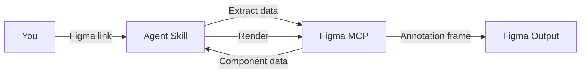

<Frame>
  <video src="/images/specs/screen-reader-output.mp4" autoPlay muted loop playsInline alt="Example screen reader spec output in Figma" />
</Frame>

Screen reader specs document how assistive technologies should announce and interact with your component across iOS (VoiceOver), Android (TalkBack), and Web (ARIA).

<Tip>
  Voice also ships as part of the [Component Markdown](/specs/component-md) output. Run `create-component-md` when you want API, structure, color, and voice in a single `.md` file instead of a Figma frame.
</Tip>

## What you need

- A **Figma link** to the component
- **Figma MCP** connected (Console MCP with Desktop Bridge, or native Figma MCP)
- A description of states, behaviors, or interactive parts that aren't visible in the design

<Tip>
  Describe all interactive parts and how they relate. For example: "The label and hint merge into the input's announcement, but the trailing clear button is a separate focus stop." This helps the agent determine focus order accurately.
</Tip>

## How to use

Reference the skill and paste your Figma link. Include context about interactive parts, states, and merge behavior for a more accurate spec:

<Tabs>
  <Tab title="Cursor">
    ```
    @create-voice https://www.figma.com/design/abc123/Components?node-id=100:200

    This is a search text field with a trailing clear button. The field has placeholder
    text "Search" and the clear button appears when text is entered. States: enabled,
    focused, filled, disabled, and error.
    ```
  </Tab>
  <Tab title="Claude Code">
    ```
    /create-voice https://www.figma.com/design/abc123/Components?node-id=100:200

    This is a search text field with a trailing clear button. The field has placeholder
    text "Search" and the clear button appears when text is entered. States: enabled,
    focused, filled, disabled, and error.
    ```
  </Tab>
  <Tab title="Codex">
    ```
    $create-voice https://www.figma.com/design/abc123/Components?node-id=100:200

    This is a search text field with a trailing clear button. The field has placeholder
    text "Search" and the clear button appears when text is entered. States: enabled,
    focused, filled, disabled, and error.
    ```
  </Tab>
</Tabs>

## What it generates

The agent analyzes your component's visual parts, determines which are independent focus stops vs. merged into another element's announcement, and renders per-platform documentation directly in your Figma file.

### Simple vs. compound components

<Tabs>
  <Tab title="Simple (1 focus stop)">
Components where all parts merge into a single focusable element.

**Examples**: Button, Checkbox with label, Switch, Toggle

The output documents one focus stop per state, with platform-specific properties for each.
  </Tab>
  <Tab title="Compound (2+ focus stops)">
Components with multiple independently focusable elements.

**Examples**: Text field with trailing clear button, Chip with dismiss action, Tab bar

The output includes a **focus order** section showing the traversal sequence, plus per-state documentation for each stop.
  </Tab>
</Tabs>

### Platform properties

Each focus stop is documented with platform-specific properties:

| Platform | Key properties |
|----------|---------------|
| **iOS (VoiceOver)** | `accessibilityLabel`, `accessibilityTraits`, `accessibilityHint`, `accessibilityValue` |
| **Android (TalkBack)** | `contentDescription`, `role`, `stateDescription` |
| **Web (ARIA)** | `role`, `aria-label`, `aria-describedby`, `aria-expanded` |

### Merge analysis

The agent determines how visual parts combine for accessibility:

| Visual part | Typical behavior |
|-------------|-----------------|
| Label | Merges into the control's announcement |
| Hint text | Becomes the accessibility hint or description |
| Decorative icons | Hidden from screen readers |
| Functional icons (e.g., clear button) | Separate focus stop |
| Action buttons | Separate focus stop |

## How it works

The screen reader skill is heavily AI-driven — the agent determines merge behavior, focus order, and platform-specific properties, while deterministic scripts handle template rendering and layout.

<Badge color="green" size="sm" shape="pill">30% Deterministic</Badge> <Badge color="purple" size="sm" shape="pill">70% AI Reasoning</Badge>



<Steps>
  <Step title="Extract">
    The skill reads child layers, element types, and interactive properties from the component via the Figma MCP.
  </Step>
  <Step title="Analyze merge behavior">
    The agent determines which visual parts are independent focus stops, which merge into another element's announcement, and which are hidden from screen readers.
  </Step>
  <Step title="Generate per-platform properties">
    Platform-specific accessibility properties are generated for iOS (VoiceOver), Android (TalkBack), and Web (ARIA) across all states.
  </Step>
  <Step title="Import template">
    The screen reader documentation template is imported from the library, instantiated, and detached into an editable frame.
  </Step>
  <Step title="Render">
    The skill fills header fields, builds focus order diagrams, state tables, and per-platform property sections.
  </Step>
  <Step title="Validate">
    A screenshot is captured and checked for completeness. Issues are fixed automatically for up to 3 iterations.
  </Step>
</Steps>

<Tip>
The skill renders programmatically, so the output is consistent and repeatable. Running it on the same component produces identical results.
</Tip>

## Tips for better output

- **List all states**: enabled, disabled, selected, expanded, loading. The agent can't infer states it can't see in Figma
- **Describe interactive parts and merge behavior**: explain which elements are tappable, which are decorative, and which should merge into another element's announcement. For example: *"The label and hint merge into the input's announcement, but the trailing clear button is a separate focus stop"*
- **Mention reactive elements**: error messages, status updates, and toasts are announced as live regions, not focus stops. Call them out if they're part of your component
- **Note focus order preferences**: if the traversal order matters (e.g., input before clear button), describe it
- **Describe state-specific announcements**: if the announcement changes based on state (e.g., a switch announcing "on" vs "off"), mention it
