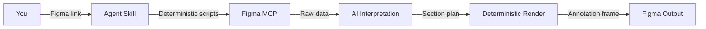

<Frame>
  <video src="/images/specs/structure-output.mp4" autoPlay muted loop playsInline alt="Example structure spec output in Figma" />
</Frame>

Structure specs document component measurements such as heights, widths, padding, and gaps, and how those values change across variants like density, size, and shape.

<Tip>
  Structure also ships as part of the [Component Markdown](/specs/component-md) output. Run `create-component-md` when you want API, structure, color, and voice in a single `.md` file instead of a Figma frame.
</Tip>

## What you need

- A **Figma link** to the component
- **Figma MCP** connected (Console MCP with Desktop Bridge, or native Figma MCP)
- Any additional context about density modes, size variants, or specific sub-components to include

<Tip>
  Tell the agent which variant axes affect dimensions. A button might vary by size, while a list item varies by density. The agent checks both explicit variants and variable mode collections.
</Tip>

## How to use

Reference the skill and paste your Figma link. Include context about which parts to measure and how dimensions vary across variants:

<Tabs>
  <Tab title="Cursor">
    ```
    @create-structure https://www.figma.com/design/abc123/Components?node-id=100:200

    This is a list item with Compact, Default, and Spacious densities. Include
    container, leading slot, label, and trailing slot dimensions.
    ```
  </Tab>
  <Tab title="Claude Code">
    ```
    /create-structure https://www.figma.com/design/abc123/Components?node-id=100:200

    This is a list item with Compact, Default, and Spacious densities. Include
    container, leading slot, label, and trailing slot dimensions.
    ```
  </Tab>
  <Tab title="Codex">
    ```
    $create-structure https://www.figma.com/design/abc123/Components?node-id=100:200

    This is a list item with Compact, Default, and Spacious densities. Include
    container, leading slot, label, and trailing slot dimensions.
    ```
  </Tab>
</Tabs>

<Tip>
  To place the annotation in a different file or page, add a destination link to your prompt:
  `Destination: https://www.figma.com/design/xyz789/Docs?node-id=0-1`
</Tip>

## What it generates

The agent measures your component and renders a documentation frame directly in your Figma file with tables showing how values change across variants.

| Aspect | What it covers |
|--------|---------------|
| Container dimensions | Heights, widths, min/max constraints |
| Padding and spacing | Horizontal and vertical padding, gaps between elements |
| Sub-component dimensions | Sizes for icons, avatars, and other nested elements |
| Token references | Links values to design tokens when they exist |
| Composition mapping | How parent sizes map to sub-component sizes |

### How tables are organized

Each section covers a part of the component (container, leading content, labels, trailing content). Columns represent variants, either sizes or density modes, so you can see how values change across configurations.

<Note>
  Some dimensional properties are controlled via Figma variable modes (like density) rather than explicit variant axes. The agent checks for both automatically.
</Note>

## How it works

The structure skill uses a two-tier architecture: deterministic scripts handle data extraction and rendering, while AI reasoning focuses on interpretation and planning.

<Badge color="green" size="sm" shape="pill">60% Deterministic</Badge> <Badge color="purple" size="sm" shape="pill">40% AI Reasoning</Badge>



<Steps>
  <Step title="Extract">
    Deterministic scripts measure dimensions, padding, gaps, token bindings, sub-components, and cross-variant comparisons via the Figma MCP.
  </Step>
  <Step title="Interpret">
    AI builds the section plan, writes design-intent notes, detects anomalies, and judges completeness.
  </Step>
  <Step title="Import template">
    The structure documentation template is imported from the library, instantiated, and detached into an editable frame.
  </Step>
  <Step title="Render">
    Deterministic scripts fill tables, place preview instances, and add native Figma measurements.
  </Step>
  <Step title="Validate">
    A screenshot is captured and checked for completeness. Issues are fixed automatically for up to 3 iterations.
  </Step>
</Steps>

<Note>
  Roughly 60% of the pipeline is deterministic scripts (extraction, rendering, measurements) and 40% is AI reasoning (section planning, notes, anomaly detection). Output is highly consistent across runs.
</Note>

## Tips for better output

- **Specify which parts to include**: container, leading content, labels, trailing content, dividers
- **Mention density or size variants**: the agent organizes columns based on these. If density is controlled via variable modes (Compact, Default, Spacious), mention the mode names
- **Describe composition relationships**: if your component is composed of multiple sub-components (e.g., Text Field = Label + Input + Hint Text), describe how parent sizes map to child sizes
- **Call out sub-components**: if a sub-component has its own spec (e.g., Avatar inside a List item), the agent cross-references it
- **Note any state-specific dimensions**: some states introduce additional properties (e.g., a focused input gaining an inner border that doesn't exist in the default state)
